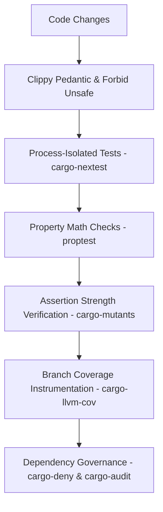
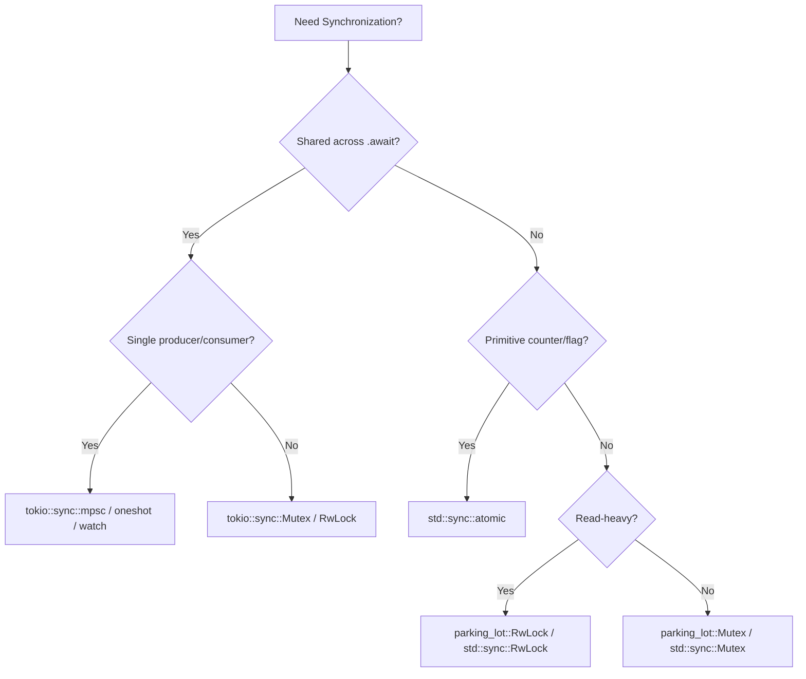

# 🦀 Production-Grade Rust Best Practices & Architecture Guide

This document presents the stability design patterns, defensive concurrency strategies, trade-off analyses, and QA tools implemented in this repository. It serves as a blueprint for engineering zero-crash, highly resilient, production-grade systems in Rust.

---

## 1. Compiler-Enforced Safety Gates

To build truly stable software, start by turning compiler and linter warnings into hard compilation failures.

### The Crate-Root Safety Guard
At the root of the crate ([`src/lib.rs`](src/lib.rs)), declare a strict lint posture:
```rust
#![deny(
    clippy::all,
    clippy::pedantic,
    clippy::nursery,
    clippy::unwrap_used,     // Deny unwrap(), force explicit error handling
    clippy::expect_used,     // Deny expect(), force structured errors
    clippy::panic,           // Deny panic!, force error bubbling
    clippy::todo,            // Deny todo! placeholders in production
    clippy::unimplemented,   // Deny unimplemented! macros
    missing_docs,            // Enforce public API documentation
    rust_2018_idioms         // Use modern Rust idioms
)]
#![forbid(unsafe_code)]      // Deny unsafe blocks; 100% compiler-proven memory safety
```

### Key Rules
1. **Never Panic**: Return a typed `Result<T, E>` to the caller. Let the application layer decide how to handle or recover from errors.
2. **Handle Every Option/Result**: Banish `unwrap()` and `expect()`. Use `if let`, `match`, or the `?` operator to propagate errors.
3. **Validate at the Boundaries**: Use `try_new()` constructors (e.g. [`RateLimiter::try_new`](src/limiter.rs#L59)) to validate configuration parameters and return domain errors instead of panicking on invalid inputs.

---

## 2. Defensive Async & Time Design Patterns

Time is a major source of bugs in asynchronous and distributed systems. Implement these patterns to guarantee deterministic, drift-free execution.

### A. Clock-Warp Panic Prevention
Monotonic clocks can drift, warp, or jump slightly backward inside VM hypervisors, cloud containers, or under NTP synchronization steps.
* ❌ **Vulnerable**: `Instant::now().duration_since(last_time)` (Panics if `last_time` is slightly in the future due to warp).
*  **Defensive**: Use `saturating_duration_since` to safely handle warp:
  ```rust
  let elapsed = Instant::now().saturating_duration_since(last_time);
  ```

### B. Schedule Drift Prevention
Rescheduling tasks using relative intervals (e.g., `Instant::now() + interval`) leads to cumulative drift over time because the scheduler tick and execution loop themselves take non-zero time.
* ❌ **Vulnerable**:
  ```rust
  // Rescheduling relative to current time causes cumulative drift
  let next_run = Instant::now() + interval;
  ```
*  **Defensive**: Reschedule relative to the fixed historical start timestamp:
  ```rust
  // Drift-free: calculated relative to the previous run's target start
  let next_run = last_run_start + interval;
  ```

### C. Preventing Asynchronous Task Leaks
In Tokio, wrapping a `JoinHandle` in a `tokio::time::timeout` does **not** abort the background task when the timeout expires. The timeout only drops the join handle future, leaving the task running as an orphan in the background worker pool.
* ❌ **Vulnerable**:
  ```rust
  // Task keeps running in the background after timeout!
  let _ = tokio::time::timeout(Duration::from_secs(1), join_handle).await;
  ```
*  **Defensive**: Clone the `AbortHandle` and abort the task explicitly on timeout:
  ```rust
  let abort_handle = join_handle.abort_handle();
  match tokio::time::timeout(timeout_duration, join_handle).await {
      Ok(result) => result?,
      Err(_) => {
          abort_handle.abort(); // Reclaim worker resources immediately
          return Err(SchedulerError::Timeout);
      }
  }
  ```

### D. Zero-Cost Future Desugaring
The `#[async_trait]` macro allocates a `Box` and uses dynamic dispatch (`Box<dyn Future>`) behind the scenes. For high-performance storage or worker traits, bypass this overhead by desugaring the trait manually with return-position `impl Future`:
```rust
pub trait JobStore: Send + Sync + 'static {
    // Zero-overhead: returns an impl Future bound by Send, bypassing async-trait boxing
    fn insert(&self, job: JobMetadata) -> impl std::future::Future<Output = Result<()>> + Send;
}
```

---

## 3. Asynchronous Mutex Lock Contention Safety

Asynchronous mutex locks (`tokio::sync::Mutex`) are cooperative. If you sleep or perform long operations while holding the lock, you block all other tasks from accessing the protected state.

### The Guard Release Pattern
Always release the lock guard **before** executing long-running or sleeping futures to prevent deadlocks and lock contention:
```rust
impl RateLimiter {
    pub async fn acquire(&self) {
        loop {
            let mut bucket = self.bucket.lock().await;
            bucket.refill();

            if bucket.tokens >= 1.0 {
                bucket.tokens -= 1.0;
                return; // Guard is dropped here automatically
            }

            let wait_duration = calculate_wait(bucket.tokens);

            // CRITICAL: Drop the guard BEFORE sleeping
            drop(bucket);
            
            // Other tasks can now inspect/refill the bucket while we sleep
            tokio::time::sleep(wait_duration).await;
        }
    }
}
```

---

## 4. Safe Panic Boundaries (Zero-Crash Workers)

When executing user-submitted tasks, a panic in the task can crash the entire worker thread or runtime. Wrap task executions in panic-catching boundaries.

### `catch_unwind` on Async Tasks
Because futures are executed across yield points, wrap them in `std::panic::AssertUnwindSafe` and catch the unwind:
```rust
use futures_util::FutureExt;

let catch_fut = std::panic::AssertUnwindSafe(task.execute()).catch_unwind();

let outcome = match catch_fut.await {
    Ok(Ok(())) => Ok(()),
    Ok(Err(err_msg)) => Err(err_msg),
    Err(panic_payload) => {
        // Extract panic message safely (handle both string literal and allocated String)
        let msg = panic_payload
            .downcast_ref::<&str>()
            .map(|s| (*s).to_string())
            .or_else(|| panic_payload.downcast_ref::<String>().cloned())
            .unwrap_or_else(|| "Unknown panic".to_string());
        Err(format!("Task panicked: {msg}"))
    }
};
```

---

## 5. Comprehensive Quality Gate & QA Toolchain

An extreme stability pipeline includes five layers of verification:



1. **`cargo-nextest`**: Process-isolated test runner with automated retries for timing-sensitive async tests ([`.config/nextest.toml`](.config/nextest.toml)).
2. **`proptest`**: Generates hundreds of randomized variations of durations and state transitions ([`tests/property_tests.rs`](tests/property_tests.rs)).
3. **`cargo-mutants`**: Injects synthetic mutations into business logic to verify test assertions fail when code is altered ([`mutants.toml`](mutants.toml)).
4. **`cargo-llvm-cov`**: Source-based line and branch coverage with strict `--fail-under-lines 95` enforcement in CI.
5. **`cargo-deny` & `cargo-audit`**: Automatically validates licenses, bans duplicate crate versions, and scans for security vulnerabilities ([`deny.toml`](deny.toml)).

---

## 6. Trade-offs & Performance Pitfalls: When NOT to Apply a Pattern

Defensive patterns are not free. Applying them indiscriminately can severely hurt throughput, memory consumption, or behavioral predictability.

| Pattern | Benefit | Trade-off / Cost | When NOT to use |
| :--- | :--- | :--- | :--- |
| **`tokio::sync::Mutex`** | Safe to hold across `.await` | **10x–50x slower** than std mutex; heap allocs on contention | Do NOT use for fast in-memory operations. Use `std::sync::Mutex` or `parking_lot` if not holding across `.await`. |
| **`catch_unwind`** | Prevents process crashes on panics | Very slow panic path; prevents `panic="abort"`; risk of corrupted state | Do NOT use for control flow or error handling. Reserve strictly for outer task/plugin boundaries. |
| **`abort_handle.abort()`** | Eliminates orphaned background tasks | Abruptly terminates tasks at next yield point | Do NOT use as the primary shutdown mechanism. Always attempt graceful shutdown (`CancellationToken`) first. |
| **`saturating_duration_since`** | Avoids panics on negative clock steps | Clamps elapsed time to zero (time "freezes") | Be aware that massive NTP backward step corrections will pause interval calculations until real time catches up. |
| **`#![forbid(unsafe_code)]`** | Compiler-proven memory safety | Prevents manual SIMD, zero-copy pointer casting, and lock-free ring buffers | Do NOT enforce in ultra-low latency kernels or HFT engines where SIMD intrinsics are required. |

---

## 7. Anti-Patterns Catalog: Common Async Rust Traps

### ❌ Anti-Pattern 1: Holding Locks Across `.await` Points
```rust
// BAD: Holding a std::sync::Mutex across .await can deadlock the OS thread
let mut guard = std_mutex.lock().unwrap();
let result = perform_async_io().await; // Blocks executor worker thread!
guard.update(result);

// GOOD: Keep lock scope synchronous, or use tokio mutex if strictly necessary
let result = perform_async_io().await;
{
    let mut guard = std_mutex.lock().unwrap();
    guard.update(result);
}
```

### ❌ Anti-Pattern 2: Unbounded Detached Task Spawning
```rust
// BAD: Fire-and-forget tasks leak if the parent service terminates
tokio::spawn(async move {
    run_background_work().await;
});

// GOOD: Track tasks in a JoinSet and link lifecycles with CancellationToken
join_set.spawn(async move {
    tokio::select! {
        () = token.cancelled() => {}
        () = run_background_work() => {}
    }
});
```

### ❌ Anti-Pattern 3: Ignoring `tokio::select!` Cancellation
```rust
// BAD: Non-atomic multi-step read dropped mid-stream loses bytes
tokio::select! {
    header = read_header(&mut socket) => {
        let body = read_body(&mut socket, header.len).await;
    }
    () = timeout.tick() => {}
}

// GOOD: Ensure futures placed in select! are cancellation-safe or state is preserved externally
```

---

## 8. Synchronization Primitive Decision Matrix



1. **Atomics (`std::sync::atomic`)**: Best for simple integers, sequence counters, and boolean flags. Zero lock overhead.
2. **Synchronous Mutex (`parking_lot::Mutex` / `std::sync::Mutex`)**: Best for protecting fast in-memory data structures (HashMaps, vectors) where lock duration is < 1µs.
3. **Async Mutex (`tokio::sync::Mutex`)**: Only use when the lock guard must remain held while executing an `.await` future.
4. **Channels (`tokio::sync::mpsc`)**: Best for actor patterns, message passing, and decoupled worker queues.

---

## 9. Formal Verification & Mathematical Invariant Proving

While `#![forbid(unsafe_code)]` and strict compiler lints guarantee memory safety and panic-freedom, security-critical components (such as cryptographic token verifiers, single-use state stores, and circular indexers) often require **mathematical proof of functional correctness**.

### A. Testing Hierarchy: Unit vs. Property vs. Formal Model Checking

| Verification Level | Tool | When to Use | What It Proves |
| :--- | :--- | :--- | :--- |
| **Unit Testing** | `cargo test` | Deterministic cases, API ergonomics | Specific input/output pairs behave as expected. |
| **Property-Based Testing** | `proptest` | Algebraic laws, duration conversions, scheduling bounds | Invariants hold across thousands of randomly sampled inputs. |
| **Mutation Testing** | `cargo mutants` | Test suite quality evaluation | Injected bugs cause tests to fail (prevents tautological tests). |
| **Formal Model Checking** | `cargo-kani` | Single-use tokens, cryptographic encoders, state machines | **Exhaustively proves** absence of panics, overflows, and invariant violations across *all* possible inputs within bounded execution depths. |

### B. Writing Kani Proof Harnesses (`#[kani::proof]`)
For critical algorithms, write dedicated verification harnesses:
```rust
#[cfg(kani)]
#[kani::proof]
fn verify_single_use_state_consumption() {
    let store = OAuthStateStore::new();
    let key: String = kani::any();
    let session: OAuthSessionState = kani::any();

    store.insert(key.clone(), session);

    // First take must return Some
    let first = store.take(&key);
    kani::assert(first.is_some(), "First take must succeed");

    // Second take MUST evaluate to None under all circumstances
    let second = store.take(&key);
    kani::assert(second.is_none(), "Single-use state must never be consumed twice");
}
```

