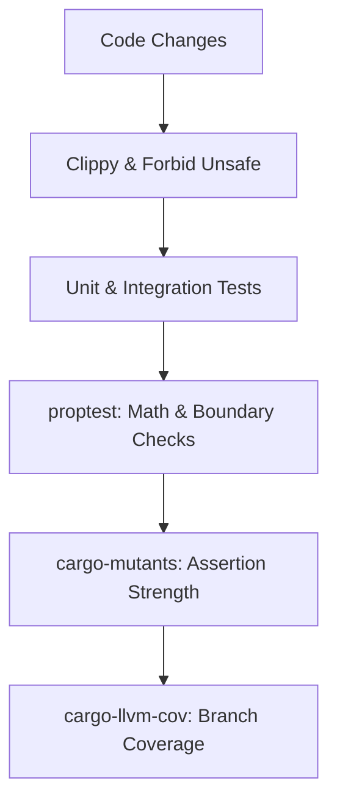

# Production-Grade Rust Best Practices Guide

This document presents the stability design patterns, defensive concurrency strategies, testing methodologies, and QA tools used to build this concurrent async task scheduler. It serves as a blueprint for engineering zero-crash, highly resilient systems in Rust.

---

## 1. Compiler-Enforced Safety Gates
To build stable software, start by turning compiler and linter warnings into compilation failures.

### The Crate-Root Safety Guard
At the root of the crate (`src/lib.rs` or `src/main.rs`), declare a strict lint posture:
```rust
#![deny(
    clippy::all,
    clippy::pedantic,
    clippy::nursery,
    clippy::unwrap_used,     // Deny unwrap(), force pattern matching
    clippy::expect_used,     // Deny expect(), force structured errors
    clippy::panic,           // Deny panic!, force error bubbling
    clippy::todo,            // Deny todo! placeholders in production
    clippy::unimplemented,   // Deny unimplemented! macros
    missing_docs,            // Enforce public API documentation
    rust_2018_idioms         // Use modern Rust idioms
)]
#![forbid(unsafe_code)]      // Deny unsafe blocks; 100% compiler-proven memory safety
```

### Key Rules
1. **Never Panic**: Return a typed `Result<T, E>` to the caller. Let the application layer decide how to recover.
2. **Handle Every Option/Result**: Banish `unwrap()` and `expect()`. Use `if let`, `match`, or the `?` operator to propagate errors.

---

## 2. Defensive Async & Time Design Patterns
Time is a major source of bugs in asynchronous systems. Implement these patterns to guarantee deterministic, drift-free execution.

### A. Clock-Warp Panic Prevention
Monotonic clocks can drift, warp, or jump slightly backward inside VM hypervisors, cloud containers, or under NTP syncs.
* **Bad**: `Instant::now().duration_since(last_time)` (Panics if `last_time` is slightly in the future due to warp).
* **Good**: Use `saturating_duration_since` to safely handle warp:
  ```rust
  let elapsed = Instant::now().saturating_duration_since(last_time);
  ```

### B. Schedule Drift Prevention
Rescheduling tasks using relative intervals (e.g., `Instant::now() + interval`) leads to drift over time because the scheduler tick itself takes time.
* **Bad**:
  ```rust
  // Rescheduling relative to current time causes drift
  let next_run = Instant::now() + interval;
  ```
* **Good**: Reschedule relative to the fixed historical start timestamp:
  ```rust
  // Drift-free: calculated relative to the previous run's target start
  let next_run = last_run_start + interval;
  ```

### C. Preventing Asynchronous Task Leaks
In Tokio, wrapping a `JoinHandle` in a `tokio::time::timeout` does **not** abort the background task when the timeout expires. The timeout only drops the join handle, leaving the task running as an orphan in the background.
* **Bad**:
  ```rust
  // Task keeps running in the background after timeout!
  let _ = tokio::time::timeout(Duration::from_secs(1), join_handle).await;
  ```
* **Good**: Clone the `AbortHandle` and abort the task explicitly on timeout:
  ```rust
  let abort_handle = join_handle.abort_handle();
  match tokio::time::timeout(timeout_duration, join_handle).await {
      Ok(result) => result?,
      Err(_) => {
          abort_handle.abort(); // Reclaim worker resources immediately
          return Err(SchedulerError::Timeout);
      }
  }
  ```

### D. Zero-Cost Future Desugaring
The `#[async_trait]` macro allocates a `Box` and uses dynamic dispatch (`Box<dyn Future>`) behind the scenes. For high-performance storage or worker traits, bypass this overhead by desugaring the trait manually:
```rust
pub trait JobStore: Send + Sync + 'static {
    // Zero-overhead: returns an impl Future bound by Send, bypassing async-trait boxing
    fn insert(&self, job: JobMetadata) -> impl std::future::Future<Output = Result<()>> + Send;
}
```

---

## 3. Asynchronous Mutex Lock Contention Safety
Asynchronous mutex locks (`tokio::sync::Mutex`) are cooperative. If you sleep or perform long operations while holding the lock, you block all other tasks from accessing the protected state.

### The Guard Release Pattern
Always release the lock guard **before** executing long-running or sleeping futures to prevent deadlocks and lock contention:
```rust
impl RateLimiter {
    pub async fn acquire(&self) {
        loop {
            let mut bucket = self.bucket.lock().await;
            bucket.refill();

            if bucket.tokens >= 1.0 {
                bucket.tokens -= 1.0;
                return; // Guard is dropped here automatically
            }

            let wait_duration = calculate_wait(bucket.tokens);

            // CRITICAL: Drop the guard BEFORE sleeping
            drop(bucket);
            
            // Other tasks can now inspect/refill the bucket while we sleep
            tokio::time::sleep(wait_duration).await;
        }
    }
}
```

---

## 4. Safe Panic Boundaries (Zero-Crash Workers)
When executing user-submitted tasks, a panic in the task can crash the entire thread pool or scheduler. Wrap task executions in panic catching boundaries.

### catch_unwind on Async Tasks
Because futures are executed across yield points, wrap them in `std::panic::AssertUnwindSafe` and catch the unwind:
```rust
use futures_util::FutureExt;

let catch_fut = std::panic::AssertUnwindSafe(task.execute()).catch_unwind();

let outcome = match catch_fut.await {
    Ok(Ok(())) => Ok(()),
    Ok(Err(err_msg)) => Err(err_msg),
    Err(panic_payload) => {
        // Extract panic message safely (handle both string literal and allocated String)
        let msg = panic_payload
            .downcast_ref::<&str>()
            .map(|s| (*s).to_string())
            .or_else(|| panic_payload.downcast_ref::<String>().cloned())
            .unwrap_or_else(|| "Unknown panic".to_string());
        Err(format!("Task panicked: {msg}"))
    }
};
```

---

## 5. Comprehensive Quality Gate & QA Toolchain

An extreme stability pipeline includes four layers of verification:



### A. Process-Isolated Test Runner: `cargo-nextest`
Standard cargo runs tests inside thread pools. If a test crashes, it corrupts the process. `nextest` runs each test in its own isolated process, preventing interference, and supports automated retries for timing-sensitive async tests.
* **Configuration** (`.config/nextest.toml`):
  ```toml
  [profile.default]
  retries = 2 # Flaky-test protection under heavy CI load
  ```

### B. Property-Based Testing: `proptest`
Generates hundreds of random variations of durations, schedules, and structural properties to search for boundary errors that manual test cases miss.
* **Example**:
  ```rust
  proptest! {
      #![proptest_config(ProptestConfig::with_cases(500))]
      #[test]
      fn test_metadata_math(delay_ms in 1u64..10000u64) {
          let delay = Duration::from_millis(delay_ms);
          let meta = JobMetadata::new(id, JobSchedule::Delayed(delay));
          prop_assert!(meta.next_run_time.is_some());
      }
  }
  ```

### C. Mutation Testing: `cargo-mutants`
Inserts deliberate logic bugs into the compiled binary (e.g. replacing `<` with `>`, deleting lock statements, or substituting addition with subtraction) to verify that your test assertions are strong enough to fail.
* **Objective**: Aim for **100% caught/timeout mutation coverage** on all business logic files.

### D. Source-Based Line/Branch Coverage: `cargo-llvm-cov`
Leverages LLVM compiler instrumentation to record which exact source code lines and branch conditions are executed.
* **CI Quality Gate**: Enforce a strict line coverage minimum (e.g. `--fail-under 95`).
* **Tip**: Use mock database stores (`FailingJobStore`) to simulate failure modes and trigger all error-propagation `?` branches.

### E. Dependency Governance: `cargo-deny`
Monitors dependencies to block security risks and version bloat:
* **Licenses**: Reject incompatible licenses (e.g., GPL) to protect intellectual property.
* **Bans**: Prevent duplicate versions of the same crate from compiling, keeping compile times short and binary sizes small.
* **Advisories**: Integrate `cargo-audit` to automatically fail the build if a dependency contains a CVE vulnerability listed in the RustSec database.
