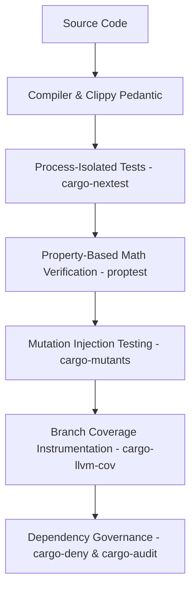

# 🦀 Rust Best Practices & Production Stability Blueprint

[](https://github.com/mike10010100/rust-best-practices/actions)
[](https://github.com/mike10010100/rust-best-practices)
[](https://github.com/mike10010100/rust-best-practices)
[](https://github.com/mike10010100/rust-best-practices)
[](Cargo.toml)

A living reference implementation, pedagogical blueprint, and proof-of-concept for engineering **zero-crash, production-grade Rust systems**.

---

## 🎯 Purpose: Why This Repository Exists

Many Rust guides discuss high-level concepts in theory, but lack a concrete, end-to-end codebase showing how all defensive programming patterns, compiler safety gates, and modern QA tools fit together.

This repository implements a fully featured, concurrent **Async Task Scheduler & Token-Bucket Rate Limiter** as a real-world case study. Every module is purpose-built to demonstrate how to eliminate subtle distributed bugs—such as monotonic clock jumps, scheduler drift, task leaks, lock starvation, and unexpected thread panics.

Whether you are a human engineer architecting mission-critical services or an AI coding agent learning production invariants, this repo serves as an executable standard.

---

## 🛡️ Stability Patterns & Proof-of-Concept Matrix

| Resilience Pattern | Vulnerability Mitigated | Implementation in Code |
| :--- | :--- | :--- |
| **Compiler Safety Gates** | Memory bugs, unhandled errors, hidden panics | [`src/lib.rs`](src/lib.rs#L1-L15) (`#![forbid(unsafe_code)]`, strict Clippy) |
| **Clock-Warp Panic Prevention** | Monotonic clock drift/jumps under NTP or VM syncs | [`src/limiter.rs`](src/limiter.rs#L18-L27) (`saturating_duration_since`) |
| **Drift-Free Rescheduling** | Cumulative interval timing drift from tick delays | [`src/store.rs`](src/store.rs#L85-L100) (Historical anchor calculation) |
| **Async Task Leak Prevention** | Orphaned background tasks continuing after timeout | [`src/scheduler.rs`](src/scheduler.rs#L164-L188) (Explicit `AbortHandle` trigger) |
| **Lock Contention Prevention** | Cooperative async task starvation & deadlocks | [`src/limiter.rs`](src/limiter.rs#L60-L80) (`drop(guard)` before `.await`) |
| **Panic-Proof Worker Isolation** | Unhandled task panics taking down the runtime loop | [`src/scheduler.rs`](src/scheduler.rs#L295-L335) (`AssertUnwindSafe` + `catch_unwind`) |
| **Zero-Cost Async Traits** | Unnecessary dynamic heap allocations (`Box<dyn Future>`) | [`src/store.rs`](src/store.rs#L13-L24) (Desugared `impl Future + Send`) |
| **Structured Error Bubbling** | Silent failures and uninformative strings | [`src/error.rs`](src/error.rs#L9-L44) (Typed enum with `thiserror`) |

For in-depth explanations and code breakdowns of each pattern, read **[BEST_PRACTICES.md](BEST_PRACTICES.md)**.

---

## 🧪 Comprehensive QA & Verification Toolchain

We use a multi-tiered testing and governance pyramid to guarantee correctness:



1. **`cargo-nextest`**: Process-isolated test runner with automated retries for timing-sensitive async tests ([`.config/nextest.toml`](.config/nextest.toml)).
2. **`proptest`**: Generates 500+ randomized parameter variations to mathematically prove scheduling intervals and conversions ([`tests/property_tests.rs`](tests/property_tests.rs)).
3. **`cargo-mutants`**: Injects synthetic mutations into business logic to verify assertions catch real regressions ([`mutants.toml`](mutants.toml)).
4. **`cargo-llvm-cov`**: Measures LLVM line/branch coverage with strict failure thresholds.
5. **`cargo-deny` & `cargo-audit`**: Automatically enforces license policies, bans duplicate crate versions, and scans for security CVEs ([`deny.toml`](deny.toml)).

For full tooling setups, CLI recipes, and CI configuration, see **[TOOLING.md](TOOLING.md)**.

---

## 📂 Repository Structure

```text
├── .config/
│   └── nextest.toml          # cargo-nextest isolation & retry configuration
├── .github/workflows/
│   └── ci.yml                # Automated multi-step quality gate workflow
├── src/
│   ├── error.rs              # Strongly typed domain errors (thiserror)
│   ├── job.rs                # Job models, schedule definitions, and metadata
│   ├── lib.rs                # Crate root with strict lint declarations
│   ├── limiter.rs            # Token-bucket rate limiter with lock-drop safety
│   ├── scheduler.rs          # Event loop, panic boundaries & join set manager
│   └── store.rs              # Desugared async storage trait & in-memory store
├── tests/
│   ├── property_tests.rs     # Randomized property tests (proptest)
│   ├── scheduler_edge_cases.rs # Mock fault-injection & failure recovery tests
│   ├── scheduler_tests.rs    # End-to-end integration and concurrency tests
│   └── store_tests.rs        # State transition and storage tests
├── BEST_PRACTICES.md         # Deep-dive stability pattern architectural guide
├── TOOLING.md                # QA toolchain documentation and usage
├── agents.md                 # AI agent development contract & quality invariants
├── Cargo.toml                # Crate manifest and dependency configuration
├── deny.toml                 # cargo-deny license and ban policy rules
└── mutants.toml              # cargo-mutants mutation testing rules
```

---

## 🚀 Quickstart & Verification

```bash
# Run formatting check
cargo fmt --all -- --check

# Run strict clippy lints (zero warnings tolerated)
cargo clippy --all-targets --all-features -- -D warnings

# Run all unit, integration, and property tests
cargo test
# or with nextest:
cargo nextest run

# Run mutation testing smoke test
cargo mutants --file src/limiter.rs

# Run dependency governance check
cargo deny check
```

---

## 🤖 For AI Coding Assistants

If you are an autonomous coding assistant or LLM operating in this repository, please review **[agents.md](agents.md)** before proposing or modifying any code. It contains the non-negotiable architectural invariants and verification protocols required for this codebase.
